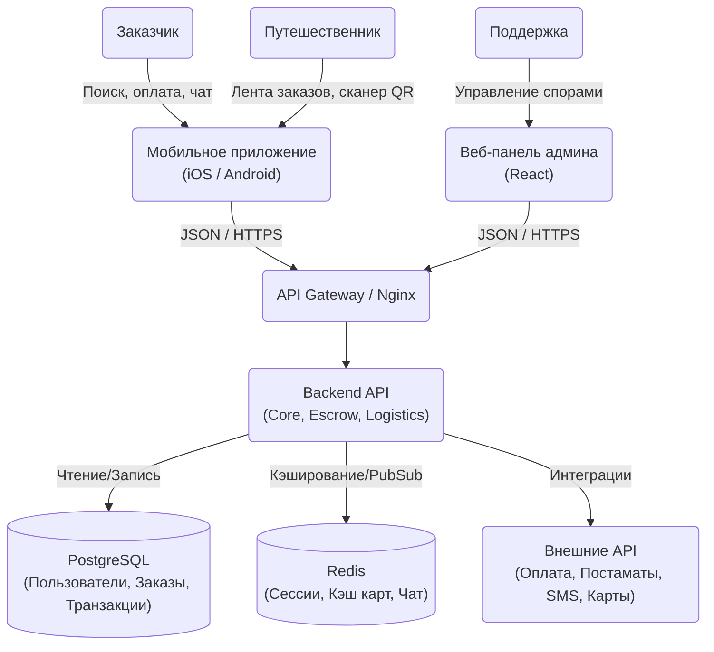

# 2026-VK-EDU-IT-Project-Yakovleva
# FlyBuy - платформа для доставки зарубежных товаров попутчиками

**Бизнес-модель:** C2C

---

## Elevator Pitch

Люди, которые хотят приобрести оригинальные товары из-за границы, сталкиваются с отсутствием прямой доставки или боятся небезопасных личных встреч с незнакомцами. Мы - FlyBuy - платформа покупок через независимых путешественников. В отличие от Grabr или Авито, мы предоставляем полностью бесконтактную передачу заказа через систему постаматов и гарантируем "безопасную сделку" внутри приложения. В результате заказчики безопасно и без стресса получают зарубежные вещи рядом с домом, а путешественники легко монетизируют свободное место в своем багаже.

---

## Lean Canvas

| № | Блок | Содержание |
|---|---|---|
| 1 | **Сегменты потребителей** |1. **Заказчики:** Подростки и студенты; интроверты; люди, не имеющие возможности выехать за границу.<br>2. **Исполнители:** Путешественники, туристы, командировочные.|
| 2 | **Проблема** | 1. Недоступность зарубежных товаров из-за санкций.<br>2. Страх личных встреч с незнакомцами (особенно актуально для несовершеннолетних и девушек).<br>3. Риск мошенничества при переводе денег на карту незнакомому байеру.|
| 3 | **Уникальная ценность** | Безопасный шопинг за рубежом с бесконтактной доставкой в постамат у дома. Никаких личных встреч и переводов на карту незнакомцам. <br>**Конкуренты:** Grabr, Авито, Юла, Telegram-каналы и группы|
| 4 | **Решение** | 1. C2C платформа, связывающая покупателей напрямую с путешественниками.<br>2. Интеграция с сетями постаматов (Яндекс, 5Post, Халва) для 100% бесконтактной передачи заказа (никаких встреч вживую).<br>3. Система «Безопасная сделка» (Escrow) внутри приложения. Деньги холдируются платформой и переводятся исполнителю только после того, как заказчик заберет товар из ящика.<br>4. Удобный интерфейс для путешественников, чтобы брать попутные заказы и монетизировать багаж. |
| 5 | **Каналы** | 1. Магазины приложений (App Store/Google Play).<br>2. Реклама у тревел-блогеров и фэшн-блогеров.<br>3. Тематические Telegram-каналы (шопинг за рубежом, скидки, кроссовки). |
| 6 | **Потоки прибыли** | 1. Сервисный сбор (комиссия платформы 5-10% от суммы заказа).<br>2. Комиссия за использование партнерских постаматов. |
| 7 | **Структура издержек** | 1. Разработка и поддержка IT-инфраструктуры приложения.<br>2. Маркетинг и привлечение пользователей.<br>3. Оплата API и логистических услуг сетей постаматов (если не перекладывается напрямую на покупателя).<br>4. Комиссии платежных систем (эквайринг). |
| 8 | **Ключевые метрики** | 1. Количество успешно завершенных сделок через постаматы в месяц.<br>2. GMV (общий объем оборота денег через платформу).<br>3. Customer Retention Rate (процент людей, сделавших повторный заказ, и процент путешественников, взявших заказы во вторую поездку). |
| 9 | **Скрытое преимущество** | Технологическая интеграция "Безопасной сделки" с логистикой постаматов, исключающая личные встречи. |

---

## Роли и User Stories

Мы выделим три основные роли в системе: **Заказчик** (покупатель товара), **Путешественник** (исполнитель/попутчик) и **Служба поддержки** (арбитраж). Для приоритизации функционала (User Stories) используем фреймворк MoSCoW:

*   Must have - обязаны
*   Should have - должны
*   Could have - могли бы
*   Won’t have - не будет

| Роль | User story | MoSCoW |
|---|---|---|
| Заказчик | Как заказчик, я хочу создать заявку с описанием товара, ссылкой и ценой, чтобы путешественники могли увидеть, что мне нужно. | M |
| Заказчик | Как заказчик, я хочу оплатить заказ через «Безопасную сделку» (деньги замораживаются), чтобы быть уверенным, что меня не кинут на деньги. | M |
| Заказчик | Как заказчик, я хочу получить SMS/Пуш с кодом от постамата рядом с домом, чтобы забрать товар бесконтактно в удобное мне время. | M |
| Заказчик | Как заказчик, я хочу нажать кнопку «Заказ получен, всё отлично», чтобы платформа перевела деньги путешественнику. | M |
| Заказчик | Как пользователь, я хочу иметь встроенный текстовый чат в приложении, чтобы уточнить детали заказа (цвет, размер) без перехода в Telegram. | S |
| Заказчик | Как заказчик, я хочу выбирать товары из готового каталога популярных вещей (например, "Хиты из Zara"), чтобы не вводить данные вручную. | W |
| Заказчик | Как пользователь, я хочу оставлять отзывы и ставить оценки (рейтинг) после сделки, чтобы другие пользователи понимали, кому можно доверять. | C |
| Заказчик | Как заказчик, я хочу получать пуш-уведомления об изменении статуса заказа (куплен, летит в РФ, в постамате). | C |
| Заказчик | Как заказчик, я хочу отменить заявку (до того, как за нее взялся исполнитель)  | S |
| Путешественник | Как путешественник, я хочу видеть ленту актуальных заказов в мой город, чтобы выбрать те, которые поместятся в мой багаж. | M |
| Путешественник | Как путешественник, я хочу сдать купленный товар в ближайший постамат (Яндекс/5Post) по штрихкоду, чтобы не тратить время на личную встречу с заказчиком. | M |
| Путешественник | Как путешественник, я хочу вывести заработанные деньги на свою российскую банковскую карту. | M |
| Путешественник | Как пользователь, я хочу иметь встроенный текстовый чат в приложении, чтобы уточнить детали заказа (цвет, размер) без перехода в Telegram. | S |
| Путешественник | Как пользователь, я хочу оставлять отзывы и ставить оценки (рейтинг) после сделки, чтобы другие пользователи понимали, кому можно доверять. | C |
| Путешественник | Как путешественник, я хочу загрузить свой авиабилет, чтобы система автоматически подобрала мне заказы по моему маршруту. | W |
| Путешественник | Как путешественник, я хочу отменить взятый заказ (со штрафом к рейтингу) | S |
| Служба поддержки | Как админ, я хочу иметь панель решения арбитражей (споров), чтобы помогать пользователям, если товар приехал поврежденным. | M |
| Служба поддержки | Как админ, я хочу заблокировать пользователя за мошенничество | M |
| Служба поддержки | Как админ, я хочу принудительно отменить сделку и вернуть деньги заказчику | S |
| Служба поддержки | Как админ, я хочу ответить на тикет пользователя в чате поддержки  | S |
| Служба поддержки | Как админ, я хочу модерировать отзывы (удалять спам/мат)  | C |

---

## MVP VS MLP
| MVP | MLP |
|---|---|
| Создание заявки на товар (ссылка, цена, описание) | Интеграция с постаматами (бесконтактная передача) |
| Лента заказов для путешественников | Рейтинги и отзывы |
| Отклик путешественника на заказ | Пуш-уведомления по статусам |
| Встроенный чат | Фото/видео подтверждение покупки |
| «Безопасная сделка» (escrow — холд денег) | |
| Подтверждение получения товара | |
| Базовая система статусов (создан → принят → куплен → доставлен) | |
| Вывод денег путешественнику | |
| Админ-панель (арбитраж + блокировки) | |

## Детализация требований для клучевых историй — FlyBuy

## История 1: Оплата через «Безопасную сделку» (Escrow)

**User Story:**  
Как заказчик, я хочу оплатить заказ через безопасную сделку, чтобы быть уверенным, что меня не обманут.

---

### Функциональные требования (ФТ)

- система позволяет пользователю нажать кнопку «Оплатить заказ»
- система отображает итоговую сумму (товар + комиссия сервиса)
- система открывает экран подтверждения оплаты
- система принимает оплату через встроенный платежный шлюз
- система изменяет статус заказа на «Оплачен» после успешной транзакции
- система замораживает (холдирует) средства до завершения сделки
- система уведомляет путешественника о том, что заказ оплачен
- система переводит деньги исполнителю только после подтверждения получения товара
- система возвращает деньги заказчику в случае отмены сделки
- система отображает ошибку при неуспешной оплате

---

### Нефункциональные требования (НФТ)

- платеж проходит без задержек (≤ 5 секунд)
- система устойчива к сбоям при оплате (нет двойных списаний)
- данные пользователя и платежа защищены
- интерфейс оплаты понятный и простой (минимум шагов)
- система доступна 24/7 (высокая надежность)

---

## История 2: Передача товара через постамат

**User Story:**  
Как путешественник, я хочу сдать товар в постамат, чтобы не встречаться лично с заказчиком.

---

### Функциональные требования (ФТ)

- система генерирует уникальный QR/штрихкод для заказа
- система показывает список доступных постаматов
- система позволяет путешественнику выбрать постамат
- система отображает инструкцию по сдаче товара
- путешественник сканирует код при сдаче товара
- система фиксирует факт размещения товара в ячейке
- система изменяет статус заказа на «В постамате»
- система отправляет заказчику уведомление с кодом получения
- заказчик вводит код и забирает товар
- система меняет статус на «Получен» после открытия ячейки

---

### Нефункциональные требования (НФТ)

- коды одноразовые и защищены от подбора
- статус заказа обновляется быстро (≤ 10 секунд)
- система корректно работает при потере соединения
- интерфейс сдачи/получения максимально простой
- система надежно хранит данные о доставке

---


## DDD (Domain-Driven Design)

Приложение разделено на 4 изолированные доменные зоны (Bounded Contexts) для четкого разделения ответственности.

| Доменная зона | Описание | Глоссарий |
| :--- | :--- | :--- |
| **Orders (Заказы)** | Создание заявок на выкуп, расчёт стоимости, хранение параметров товара. | `Order` (Заказ), `Item` (Товар), `Link` (Ссылка), `Price` (Цена). |
| **Payments (Оплата)** | Управление финансами. Безопасная сделка (Escrow), холдирование и выплаты. | `Escrow` (Удержание), `Payout` (Выплата), `Fee` (Комиссия). |
| **Logistics (Логистика)** | Интеграция с сетями постаматов. Генерация кодов, статусы ячеек. | `Locker` (Ячейка), `PIN` (Код), `Pick-up` (Забор). |
| **Users (Пользователи)** | Профили, роли, верификация документов и рейтинговая система. | `Traveler` (Попутчик), `Customer` (Заказчик), `KYC`, `Rating`. |

---

## BDD (Behavior-Driven Development)

**Критический путь:** Передача товара путешественником через постамат без личной встречи.

### Сценарий 1: Успешная закладка товара в ячейку
* **Дано:** Путешественник приехал в РФ, стоит у постамата Яндекса. Заказ имеет статус `Куплен`.
* **Когда:** Пользователь нажимает в приложении «Открыть ячейку» и сканирует QR-код на постамате.
* **Тогда:** Дверца открывается, система меняет статус заказа на `В постамате`, а Заказчик получает Push-уведомление с PIN-кодом для получения.

### Сценарий 2: Отказ (Ошибка логистики)
* **Дано:** Путешественник пытается сдать товар в выбранный постамат.
* **Когда:** Система запрашивает API логистического партнера (Яндекс/5Post) перед открытием дверцы.
* **Тогда:** API отвечает отказом. Система показывает Toast-уведомление: *«В данном постамате нет свободных ячеек нужного размера. Пожалуйста, выберите другой на карте»*, статус заказа не меняется.

---

## Wireframes (Фреймворки)

Схематичное представление ключевых экранов критического пути:

```text
[ Экран 1: Лента заказов   ]    [ Экран 2: Детали заказа     ]   [ Экран 3: Сдача в постамат ]
|                          |    |                            |   |                           |
|  [ Поиск: Москва ]       |    |  < Назад      [ Чат ]      |   |  < Назад                  |
|                          |    |                            |   |                           |
|  [ Заказ #FB-992: Dyson ]|    |     ФОТО ТОВАРА            |   |     СКАНЕР QR-КОДА        |
|  Цена: 50 000 руб        |    |                            |   |      [  [   ]  ]          |
|  Вознагр: 5 000 руб      |    |  Заказ: Стайлер Dyson      |   |                           |
|                          |    |  Откуда: Дубай (DXB)       |   |   Подойдите к постамату   |
|  [ Заказ #FB-993: Zara ] |    |  Доход: 5 000 руб          |   |   и отсканируйте код      |
|                          |    |                            |   |   для открытия ячейки     |
|  [ Взять в работу ]      |    |  [ Доставлю в РФ ]         |   |      [ Нужна помощь ]     |
```
---

## API-First (JSON-контракты)

Спроектируем взаимодействие фронтенда с бэкендом для получения данных о продукте.

### Ручка 1: Создание сессии оплаты (Холдирование средств)
`POST /api/v1/payments/hold`
Request:
```text
{
  "order_id": "FB-99201",
  "customer_id": "usr_777",
  "amount": 55000,
  "currency": "RUB",
  "payment_method_id": "pm_card_abc123"
}
```
Response (201 Created):
```text
{
  "transaction_id": "tx_xyz987",
  "status": "held",
  "message": "Средства заморожены (Escrow). Путешественник уведомлен.",
  "held_until": "2026-06-01T12:00:00Z"
}
```
### Ручка 2: Получение данных для постамата
`GET /api/v1/logistics/locker-session/{order_id}`
Response (200 OK):
```text
{
  "order_id": "FB-99201",
  "provider": "Yandex_Market",
  "qr_url": "[https://api.partner.ru/qr/99201](https://api.partner.ru/qr/99201)",
  "location": {
    "address": "ул. Бауманская, д. 53, стр. 1",
    "lat": 55.766,
    "lon": 37.684
  }
}
```
```mermaid
erDiagram
    USERS {
        uuid id PK
        string role "Customer / Traveler"
        string name
        float rating
    }

    ORDERS {
        uuid id PK
        uuid customer_id FK
        uuid traveler_id FK
        string status
        float price
        string item_url
    }

    TRANSACTIONS {
        uuid id PK
        uuid order_id FK
        float amount
        string status "held / released / refunded"
        datetime created_at
    }

    LOGISTICS {
        uuid id PK
        uuid order_id FK
        string postamat_id
        string pin_code
        boolean is_picked_up
    }

    USERS ||--o{ ORDERS : "creates (as customer)"
    USERS ||--o{ ORDERS : "delivers (as traveler)"
    ORDERS ||--|| TRANSACTIONS : "has_payment"
    ORDERS ||--|| LOGISTICS : "stored_in"
 ```   
---

## Схема C4 (Уровни 1 и 2)

Архитектура строится по принципу микросервисного монолита на старте с четким разделением доменов (Заказы, Логистика, Платежи). Мобильное приложение является единственной точкой входа для всех пользователей (Заказчиков и Путешественников).

### Уровень 1: Системный контекст (System Context)

Описывает взаимодействие пользователей с системой FlyBuy и внешними сервисами.

```mermaid
graph TD
    %% Пользователи
    Customer("Заказчик")
    Traveler("Путешественник")
    Support("Поддержка")

    %% Центральная система
    FlyBuy("FlyBuy:<br>Платформа бесконтактной<br>доставки")

    %% Внешние системы
    Payments("Платежный шлюз<br>(CloudPayments / ЮKassa)")
    Lockers("API Постаматов<br>(Яндекс, 5Post)")
    PushSMS("Сервис уведомлений<br>(FCM / APNs / SMS)")
    Geo("Гео-сервис<br>(Yandex Maps API)")

    %% Связи
    Customer -- "Создает заказы, оплачивает (Escrow),<br>получает код от постамата" --> FlyBuy
    Traveler -- "Берет заказы, сканирует QR постамата,<br>получает выплаты" --> FlyBuy
    Support -- "Решает споры (арбитраж),<br>модерирует пользователей" --> FlyBuy

    FlyBuy -- "Холдирование средств,<br>выплаты на карты" --> Payments
    FlyBuy -- "Бронь ячеек,<br>генерация PIN-кодов" --> Lockers
    FlyBuy -- "Отправка кодов получения<br>и статусов заказов" --> PushSMS
    FlyBuy -- "Поиск ближайших постаматов<br>и расчет маршрутов" --> Geo
```

---

### Уровень 2: Контейнеры (Containers)

Раскрывает внутреннее устройство платформы FlyBuy.


---

## Технологический стек MVP

| Компонент | Технология | Обоснование |
| :--- | :--- | :--- |
| **Backend** | Python / Django REST | Идеально для MVP: встроенная админка "из коробки", высокая скорость разработки, отличная работа с реляционными БД (важно для транзакций Escrow). |
| **Mobile (B2C)** | React Native | Позволяет одной команде создать приложение сразу для iOS и Android. Удобная работа с картами (поиск постаматов) и камерой (сканирование QR). |
| **Frontend (Admin)** | React + Ant Design | Быстрая сборка интерфейсов для службы поддержки (таблицы заказов, карточки арбитража) на готовых UI-компонентах. |
| **Database** | PostgreSQL | Надежная реляционная СУБД (ACID-транзакции критически важны для реализации механизма "Безопасной сделки" и холдирования средств). |
| **Infrastructure** | Docker + Nginx | Контейнеризация для быстрого развертывания и масштабирования. |
| **Cache / Brokers**| Redis | Хранение временных сессий (например, генерация одноразовых PIN-кодов для ячеек) и быстрая работа встроенного чата. |

---

## Hiring Plan (Виртуальная команда)

Для запуска MVP (доведения продукта до первых успешных бесконтактных сделок) нам нужна компактная кросс-функциональная команда.

* **Project Manager / Product Owner (1 чел.)**
  * Приоритизация бэклога (строгое отсечение фич, не влияющих на core-путь "Заказ-Постамат").
  * Переговоры с B2B-партнерами (Яндекс/5Post) для получения доступов к API постаматов.
* **Backend Developer (Python/Django) (1 чел.)**
  * Реализация сложной логики: интеграция с платежным шлюзом (холд денег) и API постаматов.
  * Проектирование БД и API контрактов.
* **Mobile Developer (React Native) (1 чел.)**
  * Разработка кроссплатформенного приложения.
  * Интеграция SDK карт и модуля сканирования штрихкодов.
* **UX/UI Designer (1 чел. - part-time)**
  * Проектирование экранов оплаты (вызывающих доверие) и интуитивных инструкций "Как положить товар в постамат".
* **QA Engineer (1 чел. - part-time)**
  * *Критическая роль!* Тестирование сценариев оплаты (отмены, возвраты) и симуляция логистики, чтобы избежать потери денег пользователей.

---

## Development Framework: Scrum + Lean Startup

Для FlyBuy критически важно быстро проверить самую рискованную гипотезу: *сможет ли путешественник без ошибок сдать товар в ячейку, а система правильно заморозить и перевести деньги.*

* **Фокус на MVP (Спринты по 2 недели):** Мы не пишем сложную рекомендательную систему для ленты заказов. Мы фокусируемся на том, чтобы "Безопасная сделка" + API постаматов работали как часы.
* **Сбор обратной связи (Lean):** Как только готово приложение, запускаем "консьерж-MVP" (тестируем на одном узком направлении, например Дубай -> Москва), чтобы выявить возможные проблемы с габаритами ячеек.

### Team Rituals (Обязательные встречи)

| Встреча | Частота | Цель |
| :--- | :--- | :--- |
| **Daily Standup** | Ежедневно (15 мин) | Синхронизация по интеграциям (особенно важно для связки Mobile -> Backend -> Внешнее API). |
| **Sprint Planning** | Раз в 2 недели | Выбор User Stories в спринт. Например: "В этом спринте подключаем холд денег в ЮKassa". |
| **Sprint Review (Demo)** | Раз в 2 недели | Стейкхолдерам показывается реальный процесс: создание заказа, оплата, симуляция открытия ячейки. |

---

## Анализ рисков проекта

Для оценки уровня риска используем шкалу: **Низкий, Средний, Высокий**.

| Риск | Тип | Уровень | Стратегия реагирования |
| :--- | :--- | :--- | :--- |
| **Сбой интеграции с постаматами** (API недоступно, дверца ячейки не открывается). | Технический | Высокий | **Смягчение:** Реализация алгоритма ручного завершения заказа через поддержку (фото товара на фоне постамата), очередь запросов. |
| **Мошенничество с Escrow** (заказчик заявляет, что в ячейке пусто или лежит "кирпич"). | Бизнес / Скам | Высокий | **Предотвращение:** Внедрение обязательной фотофиксации (путешественник фотографирует товар в открытой ячейке). Механизм "Арбитража" в админке до перевода денег. |
| **Проблемы с таможней** (путешественники везут коммерческие партии под видом личных). | Юридический | Высокий | **Минимизация:** Ограничение количества заказов на одного путешественника за одну поездку. Четкий дисклеймер об ответственности за декларирование. |
| **Несоответствие габаритов товара** (посылка не влезает в постамат). | Логистический | Средний | **Предотвращение:** Обязательное указание примерных габаритов при создании заявки. Проверка свободных ячеек нужного размера ДО отправки путешественника по адресу. |
| **Проблема "Курицы и яйца"** (мало заказов -> нет байеров; нет байеров -> уходят заказчики). | Маркетинговый | Средний | **Минимизация:** Стратегия "узкого запуска". Открываем только одно популярное направление (например, ОАЭ -> Москва) для обеспечения плотности заказов на старте. |
| **Отказ от заказа после покупки** (заказчик передумал, а товар уже куплен). | Финансовый | Низкий | **Предотвращение:** Деньги холдируются строго до того, как путешественник примет заказ в работу. При необоснованном отказе заказчика деньги уходят исполнителю. |
